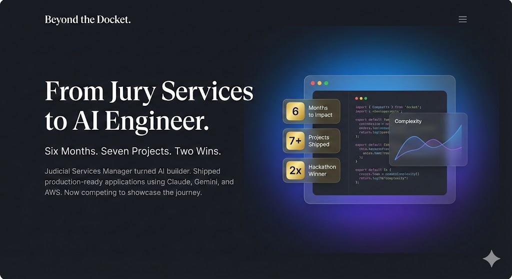

# Beyond the Docket ⚖️🚀

**Beyond the Docket** is a high-fidelity AI Builder portfolio designed for the Gemini 3.0 Hackathon. It bridges the gap between civic service and technological innovation, showcasing a "Complexity Velocity" driven career path.



## 🏛️ The Mission
This platform isn't just a portfolio—it's an interactive developer ecosystem. It features flagship AI projects like **Athena Clew** and **Janus Clew**, integrated with a live **Case Study Generator** powered by Gemini 2.0 Flash.

## ✨ Key Features
- **AI Case Study Generator**: One-click generation of professional or blog-style technical reports from project data.
- **Unified Developer Ecosystem**: Live GitHub metadata syncing (stars, forks, languages) via a custom Express proxy.
- **Cinematic UI/UX**: Premium glassmorphism effects, intelligent video loading (Intersection Observer), and animated stats.
- **Accessibility First**: WCAG AA compliant navigation, ARIA roles, and high-visibility focus states.

## 🛠️ Tech Stack
- **Frontend**: React 19, Vite, TypeScript, Tailwind CSS, Framer Motion.
- **Backend**: Node.js, Express, Gemini 2.0 Flash SDK, GitHub API.
- **Infrastructure**: Dockerized multi-stage builds for Google Cloud Run.

## 🔗 Live Demo
**[Launch Portfolio 🚀](https://beyond-the-docket-489960083310.us-west1.run.app/)**

## 🏆 The Challenge
This project was built for the **[New Year, New You Portfolio Challenge](https://dev.to/challenges/google-ai-portfolio)** presented by **[DEV.to](https://dev.to)** and **Google AI**. It serves as a showcase of developer personality, technical skill, and the power of AI-assisted software development.

## 🚀 Quick Start
```bash
# Clone the repository
git clone https://github.com/earlgreyhot1701D/beyondthedocket.git
```

## 🐳 Deployment & Tech Learned
This project marked a significant leap in my infrastructure skills. I mastered:
- **Docker**: Creating multi-stage production environments.
- **Google Cloud Run**: Serverless deployment and continuous delivery (CI/CD) via Cloud Build.
- **Express 5**: Navigating the latest changes in Node.js routing.

## 🩺 Troubleshooting

### 1. Express 5 Routing (SPA Fallback)
This project uses **Express 5**, which introduces a new router engine and stricter path-to-regexp parsing. If you encounter issues where client-side routes return 404 on refresh:
- Ensure the SPA fallback is implemented using `app.use()` as a final middleware rather than `app.get('*')`.
- This ensures compatibility with the new regex patterns while serving index.html for React Router.

### 2. ESM & Environment Variables
Since the backend uses **ES Modules (`"type": "module"`)**:
- Standard Node `__dirname` is unavailable. We use `fileURLToPath` to resolve the script location.
- The `.env` loader is configured to check multiple directory levels, supporting both raw TypeScript execution (`ts-node/esm`) and compiled production code (`dist/server.js`).

---
Created with ❤️ by **La Shara Cordero**  
*Built with Antigravity + Claude*  
*(The Chrome extension for real-time browser testing is a game changer for shipping fast)*
